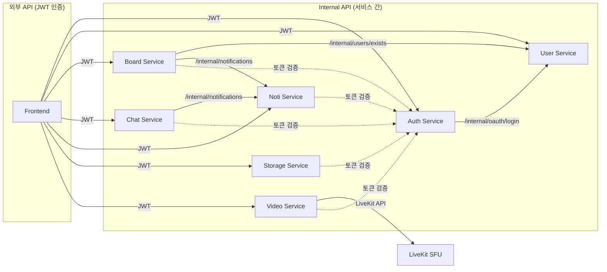

# weAlist - 협업 프로젝트 관리 플랫폼

weAlist는 팀 협업을 위한 프로젝트 관리 플랫폼입니다. 워크스페이스 기반의 프로젝트 관리, 실시간 채팅, 알림, 파일 스토리지, 영상통화 기능을 제공합니다.

---

## 목차

- [아키텍처 개요](#아키텍처-개요)
- [서비스 구성](#서비스-구성)
- [기술 스택](#기술-스택)
- [시작하기](#시작하기)
- [모니터링](#모니터링)
- [Kubernetes 배포](#kubernetes-배포)
- [문서](#문서)
- [아키텍처 결정 기록](#아키텍처-결정-기록)

---

## 아키텍처 개요

```
┌─────────────────────────────────────────────────────────────────────────────┐
│                              Client (Browser)                                │
└─────────────────────────────────────────────────────────────────────────────┘
                                      │
                                      ▼
┌─────────────────────────────────────────────────────────────────────────────┐
│                           NGINX (API Gateway) :80                            │
│    /api/auth  /api/users  /api/boards  /api/chats  /api/notifications       │
│                    /api/storage  /api/video  /ws/*                          │
└─────────────────────────────────────────────────────────────────────────────┘
          │              │              │              │              │
          ▼              ▼              ▼              ▼              ▼
┌──────────────┐ ┌──────────────┐ ┌──────────────┐ ┌──────────────┐ ┌──────────────┐
│ user-service │ │ auth-service │ │board-service │ │ chat-service │ │ noti-service │
│   (Go)       │ │ (Spring)     │ │   (Go)       │ │   (Go)       │ │   (Go)       │
│   :8081      │ │   :8080      │ │   :8000      │ │   :8001      │ │   :8002      │
└──────────────┘ └──────────────┘ └──────────────┘ └──────────────┘ └──────────────┘
          │              │              │              │              │
          ▼              ▼              ▼              ▼              ▼
┌──────────────┐ ┌──────────────┐ ┌──────────────┐
│storage-service│ │video-service │ │   frontend   │
│   (Go)       │ │   (Go)       │ │   (React)    │
│   :8003      │ │   :8004      │ │   :3000      │
└──────────────┘ └──────┬───────┘ └──────────────┘
                       │
                       ▼
┌─────────────────────────────────────────────────────────────────────────────┐
│                         Infrastructure Layer                                 │
├──────────────┬──────────────┬──────────────┬──────────────┬─────────────────┤
│  PostgreSQL  │    Redis     │    MinIO     │   LiveKit    │     Coturn      │
│    :5432     │    :6379     │  :9000/:9001 │ :7880/:7881  │  :3478/:5349    │
└──────────────┴──────────────┴──────────────┴──────────────┴─────────────────┘
```

### 서비스 간 통신



---

## 디렉토리 구조

```
wealist-project-advanced/
├── argocd/                    # ArgoCD 앱 정의
│   └── apps/
│
├── docker/                    # Docker 관련 파일
│   ├── compose/
│   │   └── docker-compose.yml
│   ├── env/
│   │   └── .env.dev.example
│   ├── init/postgres/
│   ├── nginx/
│   ├── livekit/
│   ├── coturn/
│   ├── monitoring/            # Prometheus, Loki, Grafana 설정
│   │   ├── prometheus/
│   │   ├── loki/
│   │   ├── promtail/
│   │   └── grafana/
│   └── scripts/
│       ├── dev.sh
│       ├── monitoring.sh
│       ├── test-health.sh
│       └── generate-swagger.sh
│
├── docs/                      # 문서
│   ├── K8S_SETUP.md
│   ├── infrastructure.md
│   ├── monitoring-setup.md
│   └── ports.md
│
├── infrastructure/            # 인프라 Kustomize
│   ├── base/
│   │   ├── namespace.yaml
│   │   ├── postgres/
│   │   ├── redis/
│   │   ├── coturn/
│   │   └── livekit/
│   └── overlays/
│       ├── local/
│       └── eks/
│
├── services/                  # 애플리케이션 서비스
│   ├── user-service/
│   ├── auth-service/
│   ├── board-service/
│   ├── chat-service/
│   ├── noti-service/
│   ├── storage-service/
│   ├── video-service/
│   └── frontend/
│
├── Makefile
└── README.md
```

---

## 서비스 구성

| 서비스              | 기술         | 포트 | 설명                                |
| ------------------- | ------------ | ---- | ----------------------------------- |
| **Frontend**        | React + Vite | 3000 | 웹 UI                               |
| **Auth Service**    | Spring Boot  | 8080 | JWT 토큰 관리, OAuth 인증           |
| **User Service**    | Go + Gin     | 8081 | 사용자, 워크스페이스 관리           |
| **Board Service**   | Go + Gin     | 8000 | 프로젝트, 보드, 댓글 관리           |
| **Chat Service**    | Go + Gin     | 8001 | 실시간 채팅 (WebSocket)             |
| **Noti Service**    | Go + Gin     | 8002 | 알림 관리 (SSE)                     |
| **Storage Service** | Go + Gin     | 8003 | 파일 스토리지 (Google Drive 스타일) |
| **Video Service**   | Go + Gin     | 8004 | 영상/음성 통화 (LiveKit 연동)       |

### 인프라 서비스

| 서비스     | 포트      | 설명                      |
| ---------- | --------- | ------------------------- |
| PostgreSQL | 5432      | 관계형 데이터베이스       |
| Redis      | 6379      | 캐시 및 세션 저장소       |
| MinIO      | 9000/9001 | S3 호환 오브젝트 스토리지 |
| LiveKit    | 7880/7881 | WebRTC SFU 서버           |
| Coturn     | 3478/5349 | TURN/STUN 서버            |

### 모니터링 서비스

| 서비스     | 포트 | 설명            |
| ---------- | ---- | --------------- |
| Prometheus | 9090 | 메트릭 수집     |
| Loki       | 3100 | 로그 수집       |
| Grafana    | 3001 | 시각화 대시보드 |

### 데이터베이스

| 서비스          | 데이터베이스 | 주요 테이블                             |
| --------------- | ------------ | --------------------------------------- |
| User Service    | user_db      | users, workspaces, workspace_members    |
| Board Service   | board_db     | projects, boards, comments, attachments |
| Chat Service    | chat_db      | chats, messages, chat_participants      |
| Noti Service    | noti_db      | notifications, notification_preferences |
| Storage Service | storage_db   | files, folders, shares                  |
| Video Service   | video_db     | rooms, call_history, participants       |
| Auth Service    | Redis        | refresh_tokens, blacklist               |

---

## 기술 스택

### Backend

- **Go 1.24** - User, Board, Chat, Noti, Storage, Video Service
- **Spring Boot 3** - Auth Service
- **PostgreSQL 17** - 관계형 데이터베이스
- **Redis 7.2** - 캐시 및 토큰 저장소
- **MinIO** - S3 호환 오브젝트 스토리지
- **LiveKit** - WebRTC SFU (영상통화)
- **Coturn** - TURN/STUN 서버 (NAT 트래버설)

### Frontend

- **React 18** + **Vite**
- **TypeScript**
- **TailwindCSS**
- **LiveKit Client SDK** (영상통화)

### Infrastructure

- **Docker** + **Docker Compose** - 컨테이너화
- **Kustomize** - Kubernetes 매니페스트 관리
- **ArgoCD** - GitOps 기반 배포
- **NGINX** - API Gateway / 리버스 프록시

### Monitoring

- **Prometheus** - 메트릭 수집
- **Loki** - 로그 수집
- **Promtail** - Docker 로그 수집기
- **Grafana** - 시각화 대시보드

---

## 시작하기

### 사전 요구사항

- Docker & Docker Compose
- (선택) Kubernetes (EKS 배포 시)
- (선택) kubectl & kustomize

### 로컬 개발 환경 (Docker Compose)

```bash
# 1. 환경 변수 설정
cp docker/env/.env.dev.example docker/env/.env.dev

# 2. 전체 서비스 시작
make dev-up
# 또는
./docker/scripts/dev.sh up

# 3. 서비스 접속
# - Frontend: http://localhost:3000
# - API Gateway: http://localhost:80
# - MinIO Console: http://localhost:9001

# 4. 로그 확인
make dev-logs

# 5. Health Check 테스트
./docker/scripts/test-health.sh

# 6. 서비스 종료
make dev-down
```

### Swagger API 문서

```bash
# Swagger 문서 생성
./docker/scripts/generate-swagger.sh

# 접속 URL
# - User API: http://localhost:8081/swagger/index.html
# - Auth API: http://localhost:8080/swagger-ui/index.html
# - Board API: http://localhost:8000/swagger/index.html
# - Chat API: http://localhost:8001/swagger/index.html
# - Noti API: http://localhost:8002/swagger/index.html
# - Storage API: http://localhost:8003/swagger/index.html
# - Video API: http://localhost:8004/swagger/index.html
```

---

## 모니터링

```bash
# 모니터링 스택 시작
./docker/scripts/monitoring.sh up

# 접속 정보
# - Prometheus: http://localhost:9090
# - Grafana: http://localhost:3001 (admin/admin)
# - Loki: http://localhost:3100

# 모니터링 스택 중지
./docker/scripts/monitoring.sh down
```

자세한 내용은 [docs/monitoring-setup.md](docs/monitoring-setup.md) 참조

---

## Kubernetes 배포

### Local (Minikube/Kind)

```bash
# 1. 이미지 빌드
make build-all

# 2. 배포
make k8s-apply-local

# 3. 상태 확인
kubectl get pods -n wealist-local

# 4. 삭제
make k8s-delete-local
```

### EKS 배포

```bash
# 1. 환경 변수 설정
export AWS_ACCOUNT_ID=123456789012
export AWS_REGION=ap-northeast-2
export IMAGE_TAG=v1.0.0
export RDS_ENDPOINT=wealist-db.xxx.rds.amazonaws.com

# 2. 배포
make k8s-apply-eks
```

### ArgoCD 사용

```bash
# ArgoCD 앱 배포
make argocd-apply

# ArgoCD UI 접속
kubectl port-forward svc/argocd-server -n argocd 8080:443
```

자세한 내용은 [docs/K8S_SETUP.md](docs/K8S_SETUP.md) 참조

---

## 문서

| 문서                                                 | 설명                         |
| ---------------------------------------------------- | ---------------------------- |
| [docs/K8S_SETUP.md](docs/K8S_SETUP.md)               | Kubernetes 배포 가이드       |
| [docs/infrastructure.md](docs/infrastructure.md)     | 인프라 구성 및 서비스 의존성 |
| [docs/monitoring-setup.md](docs/monitoring-setup.md) | 모니터링 설정 가이드         |
| [docs/ports.md](docs/ports.md)                       | 포트 구성 정보               |

---

## Makefile 명령어

```bash
make help              # 사용 가능한 명령어 목록

# Development
make dev-up            # Docker Compose로 전체 서비스 시작
make dev-down          # 서비스 종료
make dev-logs          # 로그 확인

# Build
make build-all         # 모든 서비스 이미지 빌드
make build-<service>   # 특정 서비스 빌드

# Kubernetes
make k8s-apply-local   # Local 환경에 배포
make k8s-apply-eks     # EKS 환경에 배포
make kustomize-<svc>   # Kustomize 미리보기

# ArgoCD
make argocd-apply      # ArgoCD 앱 배포

# Utility
make status            # 현재 상태 확인
make clean             # 정리
```

---

## 아키텍처 결정 기록 (ADR)

### ADR-001: 마이크로서비스 아키텍처 선택

**상황:** 협업 플랫폼의 여러 도메인을 어떻게 구성할 것인가?

**결정:** 도메인별 마이크로서비스 분리 (User, Auth, Board, Chat, Noti, Storage, Video)

**이유:**

- 각 도메인의 독립적인 배포 및 확장 가능
- 팀별 독립적인 개발 가능
- 장애 격리 (한 서비스 장애가 전체에 영향 X)

---

### ADR-002: 서비스별 데이터베이스 분리

**상황:** 마이크로서비스들이 데이터베이스를 공유할 것인가?

**결정:** 서비스별 독립 데이터베이스 사용 (6개 DB)

**이유:**

- 서비스 간 데이터 결합도 최소화
- 독립적인 스키마 변경 가능
- 서비스별 최적화된 DB 선택 가능

---

### ADR-003: LiveKit 기반 영상통화

**상황:** 영상/음성 통화 기능을 어떻게 구현할 것인가?

**결정:** LiveKit SFU + Coturn TURN 서버

**이유:**

- 오픈소스 SFU 솔루션 (Selective Forwarding Unit)
- 클라이언트 SDK 제공 (React)
- Coturn으로 NAT/방화벽 환경 지원
- 녹화, 스트리밍 기능 확장 가능

---

### ADR-004: Health Check 분리 (Liveness vs Readiness)

**상황:** Kubernetes에서 Pod 상태를 어떻게 체크할 것인가?

**결정:** Liveness와 Readiness 프로브 분리

```yaml
livenessProbe: # 서비스 자체가 살아있는지 (DB 무관)
  path: /health

readinessProbe: # 트래픽 수신 가능한지 (DB 연결 포함)
  path: /ready
```

**이유:**

- DB 일시적 장애 시 Pod 재시작 방지 (Liveness)
- DB 연결 안 되면 트래픽 차단 (Readiness)
- 안정적인 롤링 업데이트 지원

---

### ADR-005: Prometheus + Loki 모니터링

**상황:** 분산 시스템의 모니터링을 어떻게 구성할 것인가?

**결정:** Prometheus (메트릭) + Loki (로그) + Grafana (시각화)

**이유:**

- Prometheus: 시계열 메트릭 수집의 표준
- Loki: Prometheus와 유사한 라벨 기반 로그 시스템
- Grafana: 통합 대시보드 제공
- 오픈소스 + 커뮤니티 지원 활발

---

## 기여하기

1. Feature 브랜치 생성: `git checkout -b feature/amazing-feature`
2. 커밋: `git commit -m 'Add amazing feature'`
3. 푸시: `git push origin feature/amazing-feature`
4. Pull Request 생성

---

## 라이선스

This project is licensed under the MIT License.
