# weAlist 비즈니스 로직 다이어그램

> **작성일**: 2025-12-12
> **목적**: weAlist 플랫폼의 핵심 비즈니스 로직 흐름 시각화

---

## 목차

1. [전체 시스템 개요](#1-전체-시스템-개요)
2. [사용자 인증 플로우](#2-사용자-인증-플로우)
3. [워크스페이스 & 프로젝트 관리](#3-워크스페이스--프로젝트-관리)
4. [칸반 보드 관리](#4-칸반-보드-관리)
5. [실시간 채팅 시스템](#5-실시간-채팅-시스템)
6. [알림 시스템](#6-알림-시스템)
7. [파일 스토리지](#7-파일-스토리지)
8. [영상/음성 통화](#8-영상음성-통화)
9. [서비스 간 통신](#9-서비스-간-통신)

---

## 1. 전체 시스템 개요

### 1.1 핵심 비즈니스 도메인

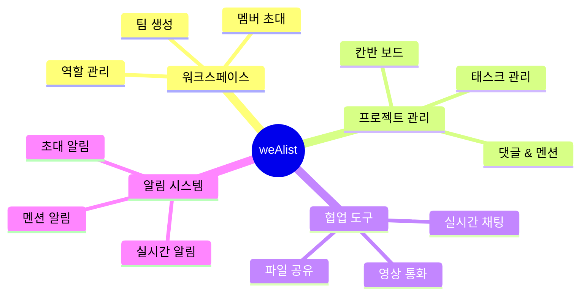
```mermaid
mindmap
  root((weAlist))
    워크스페이스
      팀 생성
      멤버 초대
      역할 관리
    프로젝트 관리
      칸반 보드
      태스크 관리
      댓글 & 멘션
    협업 도구
      실시간 채팅
      영상 통화
      파일 공유
    알림 시스템
      실시간 알림
      멘션 알림
      초대 알림
```

### 1.2 사용자 여정 (User Journey)

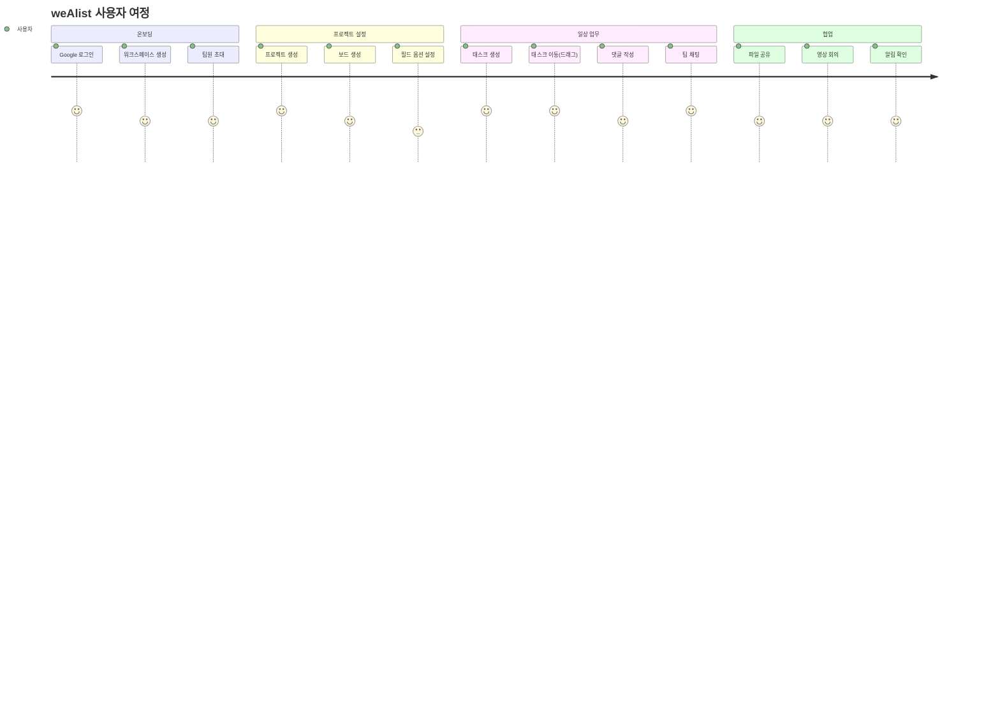
```mermaid
journey
    title weAlist 사용자 여정
    section 온보딩
      Google 로그인: 5: 사용자
      워크스페이스 생성: 4: 사용자
      팀원 초대: 4: 사용자
    section 프로젝트 설정
      프로젝트 생성: 5: 사용자
      보드 생성: 4: 사용자
      필드 옵션 설정: 3: 사용자
    section 일상 업무
      태스크 생성: 5: 사용자
      태스크 이동(드래그): 5: 사용자
      댓글 작성: 4: 사용자
      팀 채팅: 5: 사용자
    section 협업
      파일 공유: 4: 사용자
      영상 회의: 4: 사용자
      알림 확인: 4: 사용자
```

### 1.3 핵심 엔티티 관계

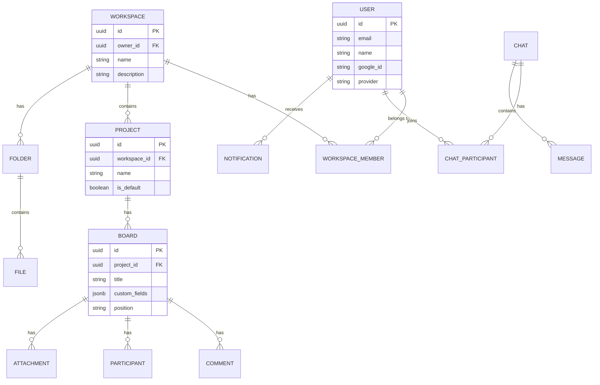
```mermaid
erDiagram
    USER ||--o{ WORKSPACE_MEMBER : "belongs to"
    WORKSPACE ||--o{ WORKSPACE_MEMBER : "has"
    WORKSPACE ||--o{ PROJECT : "contains"
    PROJECT ||--o{ BOARD : "has"
    BOARD ||--o{ COMMENT : "has"
    BOARD ||--o{ PARTICIPANT : "has"
    BOARD ||--o{ ATTACHMENT : "has"

    USER ||--o{ CHAT_PARTICIPANT : "joins"
    CHAT ||--o{ CHAT_PARTICIPANT : "has"
    CHAT ||--o{ MESSAGE : "contains"

    USER ||--o{ NOTIFICATION : "receives"

    WORKSPACE ||--o{ FOLDER : "has"
    FOLDER ||--o{ FILE : "contains"

    USER {
        uuid id PK
        string email
        string name
        string google_id
        string provider
    }

    WORKSPACE {
        uuid id PK
        uuid owner_id FK
        string name
        string description
    }

    PROJECT {
        uuid id PK
        uuid workspace_id FK
        string name
        boolean is_default
    }

    BOARD {
        uuid id PK
        uuid project_id FK
        string title
        jsonb custom_fields
        string position
    }
```

---

## 2. 사용자 인증 플로우

### 2.1 Google OAuth2 로그인

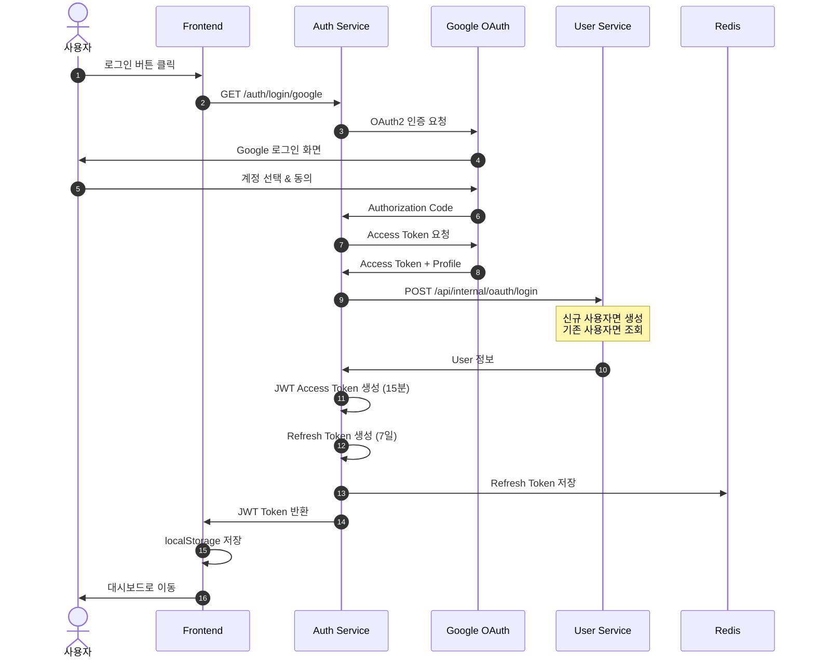
```mermaid
sequenceDiagram
    autonumber
    actor User as 사용자
    participant FE as Frontend
    participant Auth as Auth Service
    participant Google as Google OAuth
    participant UserSvc as User Service
    participant Redis as Redis

    User->>FE: 로그인 버튼 클릭
    FE->>Auth: GET /auth/login/google
    Auth->>Google: OAuth2 인증 요청
    Google->>User: Google 로그인 화면
    User->>Google: 계정 선택 & 동의
    Google->>Auth: Authorization Code
    Auth->>Google: Access Token 요청
    Google->>Auth: Access Token + Profile

    Auth->>UserSvc: POST /api/internal/oauth/login
    Note over UserSvc: 신규 사용자면 생성<br/>기존 사용자면 조회
    UserSvc->>Auth: User 정보

    Auth->>Auth: JWT Access Token 생성 (15분)
    Auth->>Auth: Refresh Token 생성 (7일)
    Auth->>Redis: Refresh Token 저장

    Auth->>FE: JWT Token 반환
    FE->>FE: localStorage 저장
    FE->>User: 대시보드로 이동
```

### 2.2 토큰 갱신 플로우

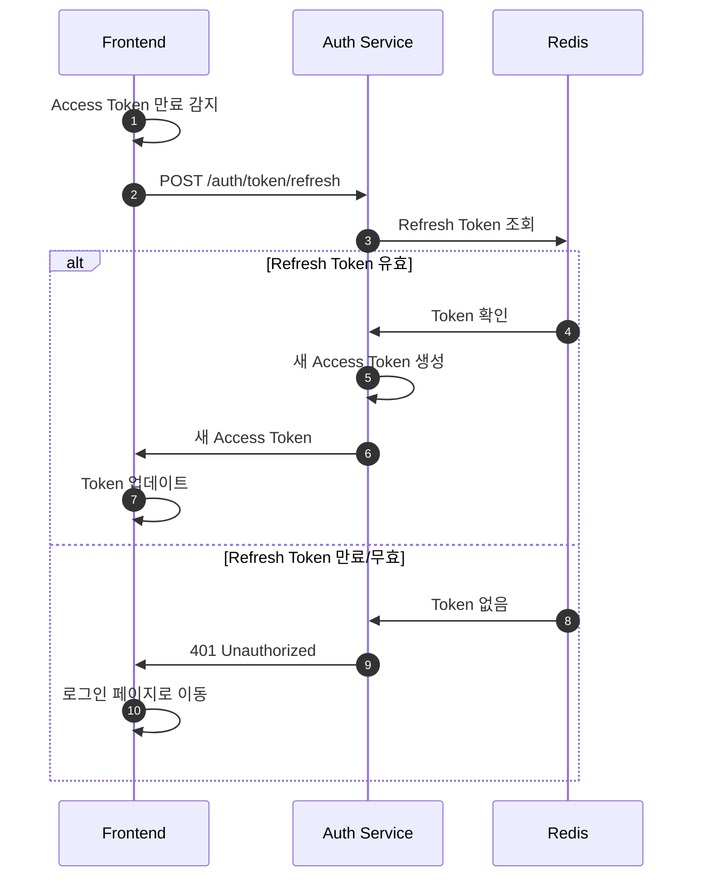
```mermaid
sequenceDiagram
    autonumber
    participant FE as Frontend
    participant Auth as Auth Service
    participant Redis as Redis

    FE->>FE: Access Token 만료 감지
    FE->>Auth: POST /auth/token/refresh
    Auth->>Redis: Refresh Token 조회

    alt Refresh Token 유효
        Redis->>Auth: Token 확인
        Auth->>Auth: 새 Access Token 생성
        Auth->>FE: 새 Access Token
        FE->>FE: Token 업데이트
    else Refresh Token 만료/무효
        Redis->>Auth: Token 없음
        Auth->>FE: 401 Unauthorized
        FE->>FE: 로그인 페이지로 이동
    end
```

### 2.3 JWT 검증 미들웨어

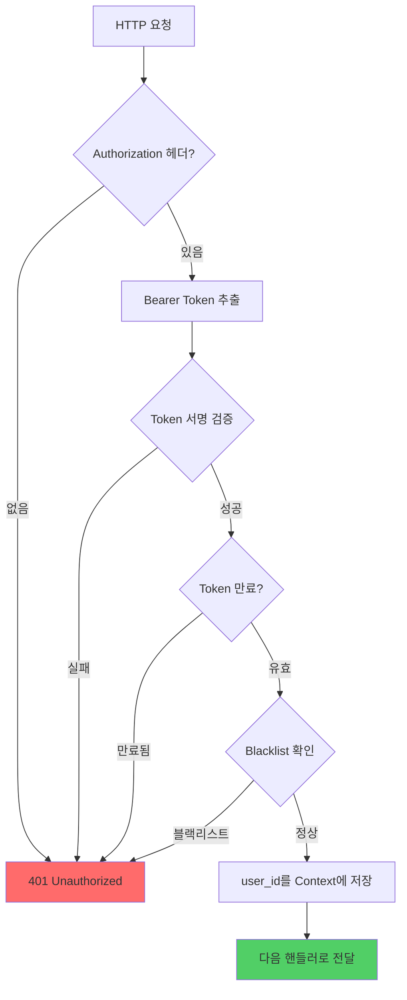
```mermaid
flowchart TD
    A[HTTP 요청] --> B{Authorization 헤더?}
    B -->|없음| C[401 Unauthorized]
    B -->|있음| D[Bearer Token 추출]
    D --> E{Token 서명 검증}
    E -->|실패| C
    E -->|성공| F{Token 만료?}
    F -->|만료됨| C
    F -->|유효| G{Blacklist 확인}
    G -->|블랙리스트| C
    G -->|정상| H[user_id를 Context에 저장]
    H --> I[다음 핸들러로 전달]

    style C fill:#ff6b6b
    style I fill:#51cf66
```

---

## 3. 워크스페이스 & 프로젝트 관리

### 3.1 워크스페이스 생성 플로우

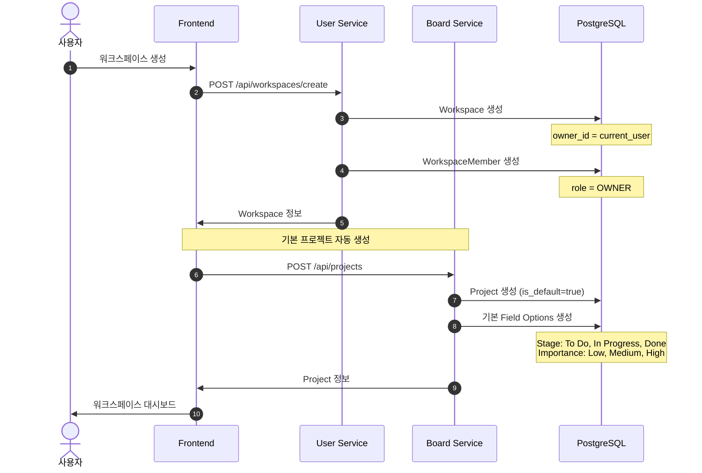
```mermaid
sequenceDiagram
    autonumber
    actor User as 사용자
    participant FE as Frontend
    participant UserSvc as User Service
    participant BoardSvc as Board Service
    participant DB as PostgreSQL

    User->>FE: 워크스페이스 생성
    FE->>UserSvc: POST /api/workspaces/create

    UserSvc->>DB: Workspace 생성
    Note over DB: owner_id = current_user

    UserSvc->>DB: WorkspaceMember 생성
    Note over DB: role = OWNER

    UserSvc->>FE: Workspace 정보

    Note over FE,BoardSvc: 기본 프로젝트 자동 생성
    FE->>BoardSvc: POST /api/projects
    BoardSvc->>DB: Project 생성 (is_default=true)
    BoardSvc->>DB: 기본 Field Options 생성
    Note over DB: Stage: To Do, In Progress, Done<br/>Importance: Low, Medium, High

    BoardSvc->>FE: Project 정보
    FE->>User: 워크스페이스 대시보드
```

### 3.2 멤버 초대 & 역할 관리

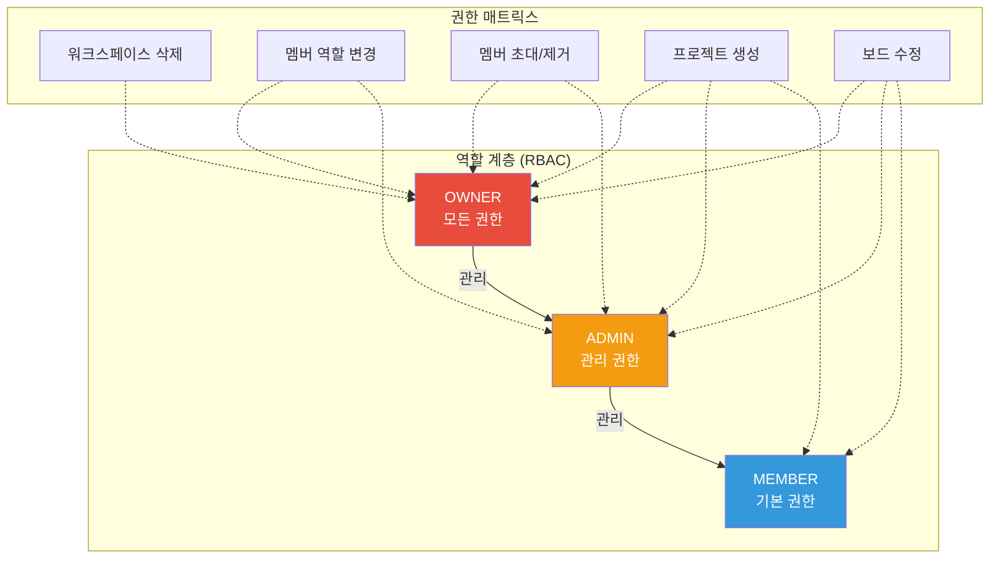
```mermaid
flowchart TD
    subgraph 역할_계층["역할 계층 (RBAC)"]
        OWNER[OWNER<br/>모든 권한]
        ADMIN[ADMIN<br/>관리 권한]
        MEMBER[MEMBER<br/>기본 권한]

        OWNER --> |관리| ADMIN
        ADMIN --> |관리| MEMBER
    end

    subgraph 권한_매트릭스["권한 매트릭스"]
        direction LR
        P1[워크스페이스 삭제] -.-> OWNER
        P2[멤버 역할 변경] -.-> OWNER
        P2 -.-> ADMIN
        P3[멤버 초대/제거] -.-> OWNER
        P3 -.-> ADMIN
        P4[프로젝트 생성] -.-> OWNER
        P4 -.-> ADMIN
        P4 -.-> MEMBER
        P5[보드 수정] -.-> OWNER
        P5 -.-> ADMIN
        P5 -.-> MEMBER
    end

    style OWNER fill:#e74c3c,color:#fff
    style ADMIN fill:#f39c12,color:#fff
    style MEMBER fill:#3498db,color:#fff
```

### 3.3 멤버 초대 시퀀스

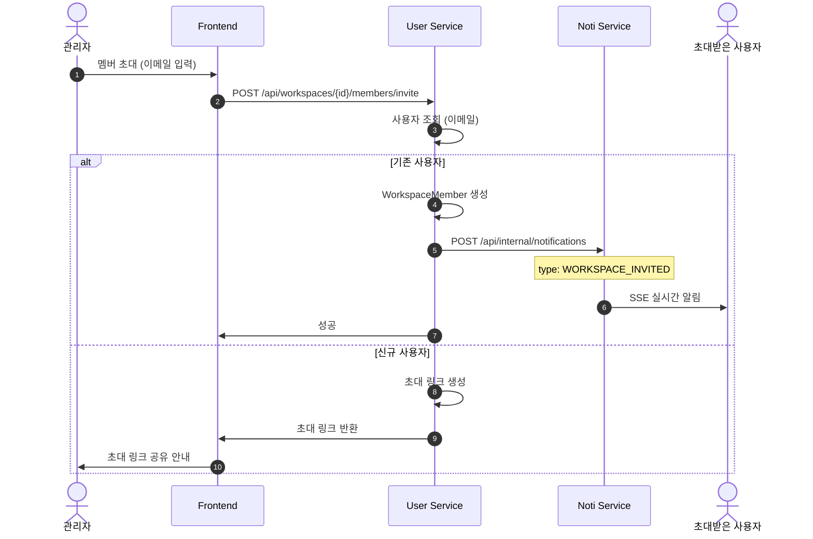
```mermaid
sequenceDiagram
    autonumber
    actor Admin as 관리자
    participant FE as Frontend
    participant UserSvc as User Service
    participant NotiSvc as Noti Service
    actor Invitee as 초대받은 사용자

    Admin->>FE: 멤버 초대 (이메일 입력)
    FE->>UserSvc: POST /api/workspaces/{id}/members/invite

    UserSvc->>UserSvc: 사용자 조회 (이메일)

    alt 기존 사용자
        UserSvc->>UserSvc: WorkspaceMember 생성
        UserSvc->>NotiSvc: POST /api/internal/notifications
        Note over NotiSvc: type: WORKSPACE_INVITED
        NotiSvc->>Invitee: SSE 실시간 알림
        UserSvc->>FE: 성공
    else 신규 사용자
        UserSvc->>UserSvc: 초대 링크 생성
        UserSvc->>FE: 초대 링크 반환
        FE->>Admin: 초대 링크 공유 안내
    end
```

---

## 4. 칸반 보드 관리

### 4.1 보드 CRUD 플로우

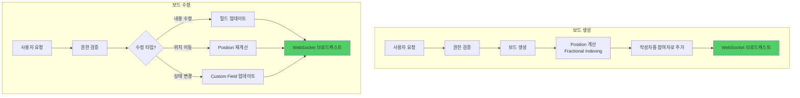
```mermaid
flowchart TD
    subgraph 보드_생성["보드 생성"]
        C1[사용자 요청] --> C2[권한 검증]
        C2 --> C3[보드 생성]
        C3 --> C4[Position 계산<br/>Fractional Indexing]
        C4 --> C5[작성자를 참여자로 추가]
        C5 --> C6[WebSocket 브로드캐스트]
    end

    subgraph 보드_수정["보드 수정"]
        U1[사용자 요청] --> U2[권한 검증]
        U2 --> U3{수정 타입?}
        U3 -->|내용 수정| U4[필드 업데이트]
        U3 -->|위치 이동| U5[Position 재계산]
        U3 -->|상태 변경| U6[Custom Field 업데이트]
        U4 --> U7[WebSocket 브로드캐스트]
        U5 --> U7
        U6 --> U7
    end

    style C6 fill:#51cf66
    style U7 fill:#51cf66
```

### 4.2 Fractional Indexing (보드 위치 이동)

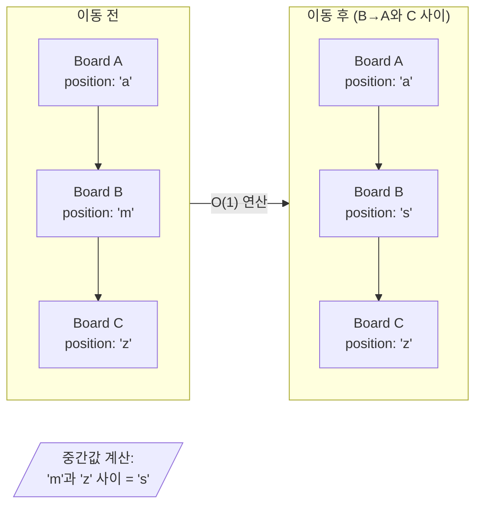
```mermaid
flowchart LR
    subgraph Before["이동 전"]
        B1["Board A<br/>position: 'a'"]
        B2["Board B<br/>position: 'm'"]
        B3["Board C<br/>position: 'z'"]
        B1 --> B2 --> B3
    end

    subgraph After["이동 후 (B→A와 C 사이)"]
        A1["Board A<br/>position: 'a'"]
        A2["Board B<br/>position: 's'"]
        A3["Board C<br/>position: 'z'"]
        A1 --> A2 --> A3
    end

    Before -->|"O(1) 연산"| After

    Note1[/"중간값 계산:<br/>'m'과 'z' 사이 = 's'"/]
```

### 4.3 Custom Fields 시스템

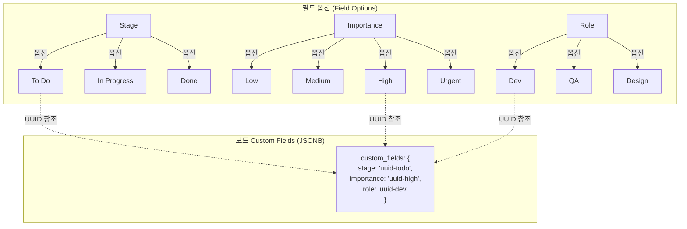
```mermaid
flowchart TD
    subgraph FieldOptions["필드 옵션 (Field Options)"]
        FO1[Stage]
        FO2[Importance]
        FO3[Role]

        FO1 --> |옵션| S1[To Do]
        FO1 --> |옵션| S2[In Progress]
        FO1 --> |옵션| S3[Done]

        FO2 --> |옵션| I1[Low]
        FO2 --> |옵션| I2[Medium]
        FO2 --> |옵션| I3[High]
        FO2 --> |옵션| I4[Urgent]

        FO3 --> |옵션| R1[Dev]
        FO3 --> |옵션| R2[QA]
        FO3 --> |옵션| R3[Design]
    end

    subgraph Board["보드 Custom Fields (JSONB)"]
        CF["custom_fields: {<br/>  stage: 'uuid-todo',<br/>  importance: 'uuid-high',<br/>  role: 'uuid-dev'<br/>}"]
    end

    S1 -.->|UUID 참조| CF
    I3 -.->|UUID 참조| CF
    R1 -.->|UUID 참조| CF
```

### 4.4 댓글 & 멘션 시스템

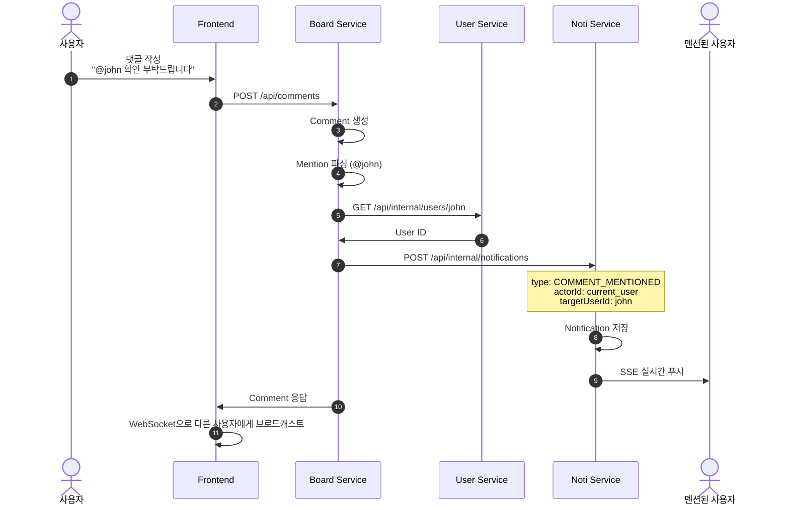
```mermaid
sequenceDiagram
    autonumber
    actor User as 사용자
    participant FE as Frontend
    participant BoardSvc as Board Service
    participant UserSvc as User Service
    participant NotiSvc as Noti Service
    actor Mentioned as 멘션된 사용자

    User->>FE: 댓글 작성<br/>"@john 확인 부탁드립니다"
    FE->>BoardSvc: POST /api/comments

    BoardSvc->>BoardSvc: Comment 생성
    BoardSvc->>BoardSvc: Mention 파싱 (@john)
    BoardSvc->>UserSvc: GET /api/internal/users/john
    UserSvc->>BoardSvc: User ID

    BoardSvc->>NotiSvc: POST /api/internal/notifications
    Note over NotiSvc: type: COMMENT_MENTIONED<br/>actorId: current_user<br/>targetUserId: john

    NotiSvc->>NotiSvc: Notification 저장
    NotiSvc->>Mentioned: SSE 실시간 푸시

    BoardSvc->>FE: Comment 응답
    FE->>FE: WebSocket으로 다른 사용자에게 브로드캐스트
```

### 4.5 보드 실시간 동기화

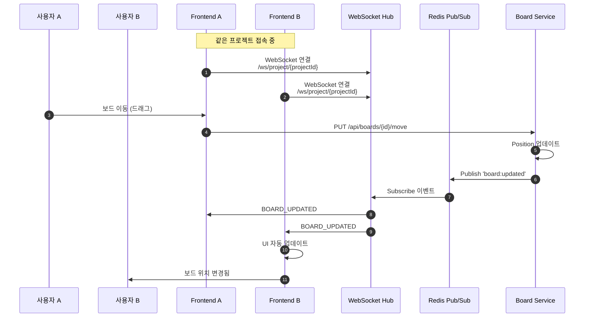
```mermaid
sequenceDiagram
    autonumber
    participant User1 as 사용자 A
    participant User2 as 사용자 B
    participant FE1 as Frontend A
    participant FE2 as Frontend B
    participant WS as WebSocket Hub
    participant Redis as Redis Pub/Sub
    participant BoardSvc as Board Service

    Note over FE1,FE2: 같은 프로젝트 접속 중

    FE1->>WS: WebSocket 연결<br/>/ws/project/{projectId}
    FE2->>WS: WebSocket 연결<br/>/ws/project/{projectId}

    User1->>FE1: 보드 이동 (드래그)
    FE1->>BoardSvc: PUT /api/boards/{id}/move
    BoardSvc->>BoardSvc: Position 업데이트
    BoardSvc->>Redis: Publish 'board:updated'

    Redis->>WS: Subscribe 이벤트
    WS->>FE1: BOARD_UPDATED
    WS->>FE2: BOARD_UPDATED

    FE2->>FE2: UI 자동 업데이트
    FE2->>User2: 보드 위치 변경됨
```

---

## 5. 실시간 채팅 시스템

### 5.1 채팅방 타입

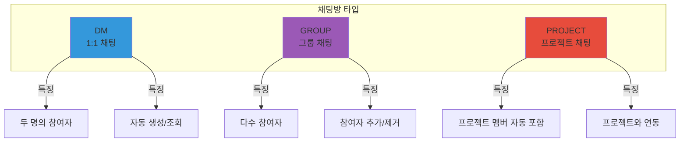
```mermaid
flowchart TD
    subgraph ChatTypes["채팅방 타입"]
        DM[DM<br/>1:1 채팅]
        GROUP[GROUP<br/>그룹 채팅]
        PROJECT[PROJECT<br/>프로젝트 채팅]
    end

    DM --> |특징| DM1[두 명의 참여자]
    DM --> |특징| DM2[자동 생성/조회]

    GROUP --> |특징| G1[다수 참여자]
    GROUP --> |특징| G2[참여자 추가/제거]

    PROJECT --> |특징| P1[프로젝트 멤버 자동 포함]
    PROJECT --> |특징| P2[프로젝트와 연동]

    style DM fill:#3498db
    style GROUP fill:#9b59b6
    style PROJECT fill:#e74c3c
```

### 5.2 메시지 전송 플로우

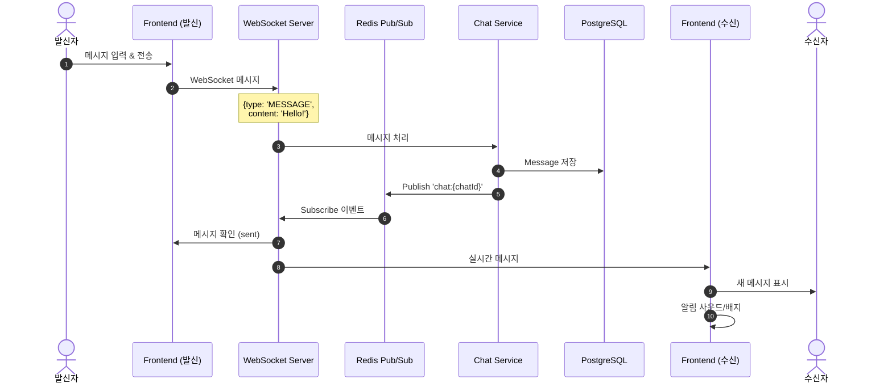
```mermaid
sequenceDiagram
    autonumber
    actor Sender as 발신자
    participant FE1 as Frontend (발신)
    participant WS as WebSocket Server
    participant Redis as Redis Pub/Sub
    participant ChatSvc as Chat Service
    participant DB as PostgreSQL
    participant FE2 as Frontend (수신)
    actor Receiver as 수신자

    Sender->>FE1: 메시지 입력 & 전송
    FE1->>WS: WebSocket 메시지
    Note over WS: {type: 'MESSAGE',<br/>content: 'Hello!'}

    WS->>ChatSvc: 메시지 처리
    ChatSvc->>DB: Message 저장
    ChatSvc->>Redis: Publish 'chat:{chatId}'

    Redis->>WS: Subscribe 이벤트
    WS->>FE1: 메시지 확인 (sent)
    WS->>FE2: 실시간 메시지

    FE2->>Receiver: 새 메시지 표시
    FE2->>FE2: 알림 사운드/배지
```

### 5.3 메시지 읽음 상태

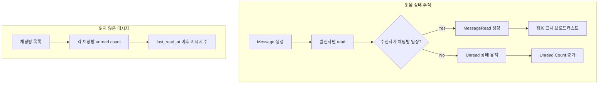
```mermaid
flowchart TD
    subgraph ReadTracking["읽음 상태 추적"]
        M1[Message 생성] --> M2[발신자만 read]
        M2 --> M3{수신자가 채팅방 입장?}
        M3 -->|Yes| M4[MessageRead 생성]
        M3 -->|No| M5[Unread 상태 유지]
        M4 --> M6[읽음 표시 브로드캐스트]
        M5 --> M7[Unread Count 증가]
    end

    subgraph UnreadBadge["읽지 않은 메시지"]
        B1[채팅방 목록] --> B2[각 채팅방 unread count]
        B2 --> B3[last_read_at 이후 메시지 수]
    end
```

### 5.4 사용자 상태 (Presence)

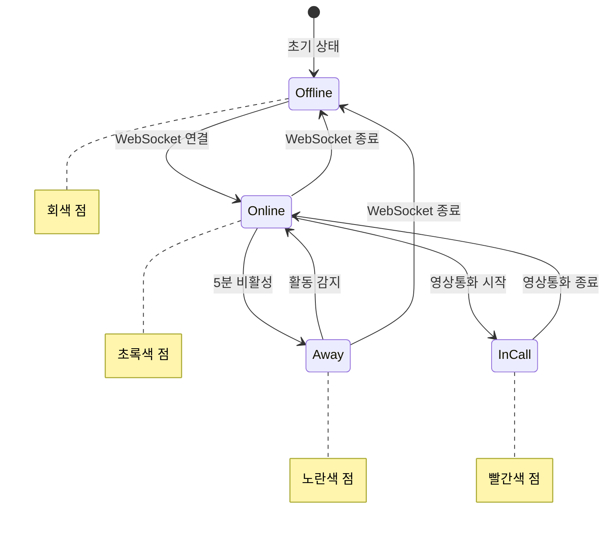
```mermaid
stateDiagram-v2
    [*] --> Offline: 초기 상태

    Offline --> Online: WebSocket 연결
    Online --> Away: 5분 비활성
    Away --> Online: 활동 감지
    Online --> Offline: WebSocket 종료
    Away --> Offline: WebSocket 종료

    Online --> InCall: 영상통화 시작
    InCall --> Online: 영상통화 종료

    note right of Online: 초록색 점
    note right of Away: 노란색 점
    note right of Offline: 회색 점
    note right of InCall: 빨간색 점
```

---

## 6. 알림 시스템

### 6.1 알림 타입

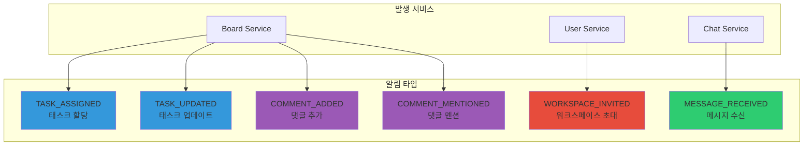
```mermaid
flowchart TD
    subgraph NotiTypes["알림 타입"]
        N1[TASK_ASSIGNED<br/>태스크 할당]
        N2[TASK_UPDATED<br/>태스크 업데이트]
        N3[COMMENT_ADDED<br/>댓글 추가]
        N4[COMMENT_MENTIONED<br/>댓글 멘션]
        N5[WORKSPACE_INVITED<br/>워크스페이스 초대]
        N6[MESSAGE_RECEIVED<br/>메시지 수신]
    end

    subgraph Sources["발생 서비스"]
        S1[Board Service]
        S2[User Service]
        S3[Chat Service]
    end

    S1 --> N1
    S1 --> N2
    S1 --> N3
    S1 --> N4
    S2 --> N5
    S3 --> N6

    style N1 fill:#3498db
    style N2 fill:#3498db
    style N3 fill:#9b59b6
    style N4 fill:#9b59b6
    style N5 fill:#e74c3c
    style N6 fill:#2ecc71
```

### 6.2 SSE 실시간 알림 플로우

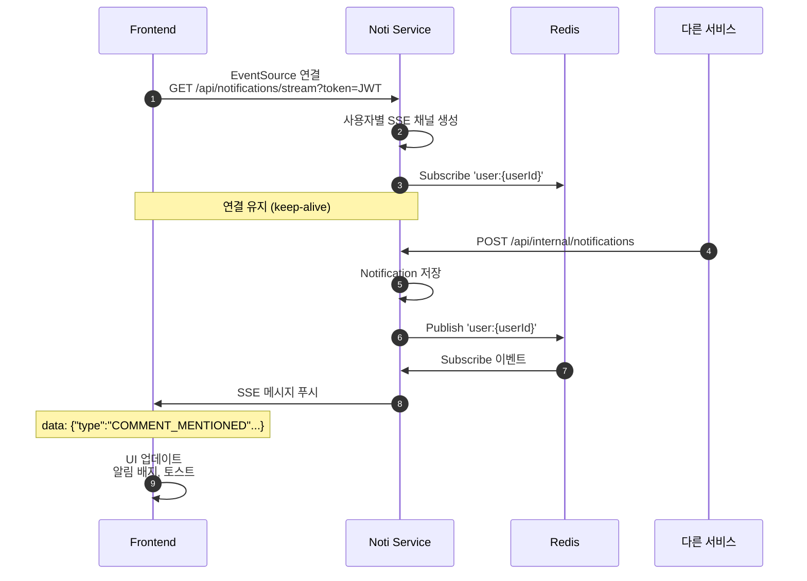
```mermaid
sequenceDiagram
    autonumber
    participant FE as Frontend
    participant NotiSvc as Noti Service
    participant Redis as Redis
    participant Source as 다른 서비스

    FE->>NotiSvc: EventSource 연결<br/>GET /api/notifications/stream?token=JWT
    NotiSvc->>NotiSvc: 사용자별 SSE 채널 생성
    NotiSvc->>Redis: Subscribe 'user:{userId}'

    Note over FE,NotiSvc: 연결 유지 (keep-alive)

    Source->>NotiSvc: POST /api/internal/notifications
    NotiSvc->>NotiSvc: Notification 저장
    NotiSvc->>Redis: Publish 'user:{userId}'

    Redis->>NotiSvc: Subscribe 이벤트
    NotiSvc->>FE: SSE 메시지 푸시
    Note over FE: data: {"type":"COMMENT_MENTIONED"...}

    FE->>FE: UI 업데이트<br/>알림 배지, 토스트
```

### 6.3 알림 설정 관리

```mermaid
flowchart TD
    subgraph Preferences["알림 설정"]
        P1[NotificationPreference]
        P2[user_id]
        P3[workspace_id<br/>optional]
        P4[type]
        P5[enabled]
    end

    subgraph Flow["알림 생성 플로우"]
        F1[알림 이벤트 발생] --> F2{설정 확인}
        F2 -->|workspace 설정| F3{enabled?}
        F2 -->|global 설정| F4{enabled?}
        F3 -->|Yes| F5[알림 생성]
        F3 -->|No| F6[Skip]
        F4 -->|Yes| F5
        F4 -->|No| F6
    end

    P1 --> P2
    P1 --> P3
    P1 --> P4
    P1 --> P5
```

---

## 7. 파일 스토리지

### 7.1 파일 업로드 플로우

```mermaid
sequenceDiagram
    autonumber
    actor User as 사용자
    participant FE as Frontend
    participant StorageSvc as Storage Service
    participant MinIO as MinIO (S3)
    participant DB as PostgreSQL

    User->>FE: 파일 선택
    FE->>StorageSvc: POST /api/storage/files/upload-url
    Note over StorageSvc: fileName, fileSize, contentType

    StorageSvc->>StorageSvc: 저장소 할당량 확인
    StorageSvc->>MinIO: Presigned Upload URL 생성
    MinIO->>StorageSvc: URL (15분 유효)
    StorageSvc->>FE: Upload URL + file_id

    FE->>MinIO: PUT 파일 업로드<br/>(Presigned URL)
    MinIO->>FE: 200 OK

    FE->>StorageSvc: POST /api/storage/files/confirm
    StorageSvc->>MinIO: 객체 존재 확인
    StorageSvc->>DB: File 레코드 생성
    StorageSvc->>FE: File 정보 반환
```

### 7.2 폴더 & 파일 구조

```mermaid
flowchart TD
    subgraph Workspace["워크스페이스"]
        ROOT[루트 폴더<br/>자동 생성]

        ROOT --> F1[문서]
        ROOT --> F2[이미지]
        ROOT --> F3[프로젝트 파일]

        F1 --> F1_1[계약서.pdf]
        F1 --> F1_2[보고서.docx]

        F2 --> F2_1[로고.png]

        F3 --> F3_1[설계서.pdf]
        F3 --> F3_2[하위 폴더]
        F3_2 --> F3_2_1[스크린샷.jpg]
    end

    subgraph ProjectStorage["프로젝트 스토리지"]
        PS[Project Storage]
        PS --> PA[Project A 폴더]
        PS --> PB[Project B 폴더]

        PA --> PA1[Board 첨부파일]
        PA --> PA2[Comment 첨부파일]
    end
```

### 7.3 파일 공유 시스템

```mermaid
flowchart TD
    subgraph ShareTypes["공유 타입"]
        ST1[READONLY<br/>읽기 전용]
        ST2[EDIT<br/>편집 가능]
    end

    subgraph ShareFlow["공유 플로우"]
        SF1[파일/폴더 선택] --> SF2[공유 생성]
        SF2 --> SF3[공유 링크 생성<br/>unique token]
        SF3 --> SF4[링크 공유]
        SF4 --> SF5{수신자 접근}
        SF5 --> SF6{로그인 필요?}
        SF6 -->|Public| SF7[바로 접근]
        SF6 -->|Private| SF8[로그인 후 접근]
    end

    subgraph PublicAccess["공개 링크"]
        PA1["GET /shares/link/:token"]
        PA2[토큰 검증]
        PA3[파일 정보 반환]
        PA4[Presigned Download URL]

        PA1 --> PA2 --> PA3 --> PA4
    end
```

---

## 8. 영상/음성 통화

### 8.1 영상통화 아키텍처

```mermaid
flowchart TD
    subgraph Clients["클라이언트"]
        C1[Browser A]
        C2[Browser B]
        C3[Browser C]
    end

    subgraph VideoService["Video Service"]
        VS[Video Service<br/>:8004]
        VS --> |Room 관리| DB[(PostgreSQL)]
    end

    subgraph LiveKit["LiveKit SFU"]
        LK[LiveKit Server<br/>:7880]
        LK --> |스트림| LK1[Room 1]
        LK --> |스트림| LK2[Room 2]
    end

    subgraph TURN["NAT Traversal"]
        CT[Coturn<br/>STUN/TURN]
    end

    C1 <-->|WebRTC| LK
    C2 <-->|WebRTC| LK
    C3 <-->|WebRTC| LK

    C1 <-->|ICE| CT
    C2 <-->|ICE| CT
    C3 <-->|ICE| CT

    C1 -->|REST API| VS
    C2 -->|REST API| VS
    C3 -->|REST API| VS
```

### 8.2 영상통화 시작 플로우

```mermaid
sequenceDiagram
    autonumber
    actor Host as 호스트
    participant FE as Frontend
    participant VideoSvc as Video Service
    participant LiveKit as LiveKit
    participant DB as PostgreSQL

    Host->>FE: 영상통화 시작
    FE->>VideoSvc: POST /api/rooms
    Note over VideoSvc: title, workspaceId

    VideoSvc->>DB: Room 레코드 생성
    VideoSvc->>LiveKit: POST /rooms
    LiveKit->>VideoSvc: Room 생성 완료

    VideoSvc->>LiveKit: Token 생성 요청
    LiveKit->>VideoSvc: Room Token (JWT)
    VideoSvc->>DB: Token 저장

    VideoSvc->>FE: Room 정보 + Token

    FE->>LiveKit: WebRTC 연결<br/>connect(url, token)
    LiveKit->>FE: 연결 완료

    FE->>FE: 로컬 스트림 시작<br/>(카메라/마이크)
    FE->>Host: 영상통화 화면
```

### 8.3 참여자 입장/퇴장

```mermaid
sequenceDiagram
    autonumber
    actor Participant as Participant
    participant FE as Frontend
    participant VideoSvc as Video Service
    participant LiveKit as LiveKit
    participant DB as PostgreSQL
    actor Others as Others

    Participant->>FE: Join Room
    FE->>VideoSvc: POST /rooms/:id/join

    VideoSvc->>DB: Create Participant
    VideoSvc->>LiveKit: Generate Token
    LiveKit->>VideoSvc: Room Token
    VideoSvc->>FE: Return Token

    FE->>LiveKit: WebRTC Connect
    LiveKit->>FE: Receive Streams
    LiveKit->>Others: Send New Stream

    Note over FE,Others: Video Call in Progress

    Participant->>FE: Leave Button
    FE->>VideoSvc: POST /rooms/:id/leave
    VideoSvc->>DB: Update left_at
    FE->>LiveKit: Disconnect
    LiveKit->>Others: Participant Left
```

---

## 9. 서비스 간 통신

### 9.1 통신 패턴 개요

```mermaid
flowchart TD
    subgraph Sync["동기 통신"]
        S1[REST API]
        S2[JWT/API Key 인증]
        S3[HTTP/HTTPS]
    end

    subgraph Async["비동기 통신"]
        A1[WebSocket]
        A2[SSE]
        A3[Redis Pub/Sub]
    end

    subgraph Internal["내부 통신"]
        I1["/api/internal/*"]
        I2[API Key 인증]
        I3[서비스 간 직접 호출]
    end

    FE[Frontend] --> S1
    FE --> A1
    FE --> A2

    S1 --> Services[Backend Services]
    Services --> I1
    Services --> A3
```

### 9.2 서비스 의존성 맵

```mermaid
flowchart TD
    subgraph Frontend["Frontend Layer"]
        FE[React App<br/>:3000]
    end

    subgraph Gateway["API Gateway"]
        NGINX[NGINX<br/>:80]
    end

    subgraph Services["Backend Services"]
        AUTH[Auth Service<br/>Spring Boot<br/>:8080]
        USER[User Service<br/>Go/Gin<br/>:8081]
        BOARD[Board Service<br/>Go/Gin<br/>:8000]
        CHAT[Chat Service<br/>Go/Gin<br/>:8001]
        NOTI[Noti Service<br/>Go/Gin<br/>:8002]
        STORAGE[Storage Service<br/>Go/Gin<br/>:8003]
        VIDEO[Video Service<br/>Go/Gin<br/>:8004]
    end

    subgraph Data["Data Layer"]
        PG[(PostgreSQL<br/>7 DBs)]
        REDIS[(Redis)]
        MINIO[(MinIO S3)]
        LK[LiveKit]
    end

    FE --> NGINX
    NGINX --> AUTH
    NGINX --> USER
    NGINX --> BOARD
    NGINX --> CHAT
    NGINX --> NOTI
    NGINX --> STORAGE
    NGINX --> VIDEO

    AUTH -->|"OAuth Login"| USER
    AUTH --> REDIS

    BOARD -->|"User Check"| USER
    BOARD -->|"Notification"| NOTI
    BOARD --> PG

    CHAT -->|"Notification"| NOTI
    CHAT --> PG
    CHAT --> REDIS

    NOTI --> PG
    NOTI --> REDIS

    STORAGE --> PG
    STORAGE --> MINIO

    VIDEO --> PG
    VIDEO --> LK

    USER --> PG
    USER --> REDIS

    style AUTH fill:#e74c3c,color:#fff
    style USER fill:#3498db,color:#fff
    style BOARD fill:#2ecc71,color:#fff
    style CHAT fill:#9b59b6,color:#fff
    style NOTI fill:#f39c12,color:#fff
    style STORAGE fill:#1abc9c,color:#fff
    style VIDEO fill:#e91e63,color:#fff
```

### 9.3 내부 API 호출 매트릭스

| 호출 서비스 | 대상 서비스 | 엔드포인트                            | 목적                   |
| ----------- | ----------- | ------------------------------------- | ---------------------- |
| Auth        | User        | `POST /api/internal/oauth/login`      | OAuth 사용자 생성/조회 |
| Board       | User        | `GET /api/internal/users/{id}/exists` | 사용자 존재 확인       |
| Board       | Noti        | `POST /api/internal/notifications`    | 알림 생성              |
| Chat        | Noti        | `POST /api/internal/notifications`    | 알림 생성              |
| Storage     | User        | `GET /api/internal/users/{id}`        | 소유자 확인            |

---

> **문서 버전**: v1.0
> **최종 수정**: 2025-12-12
