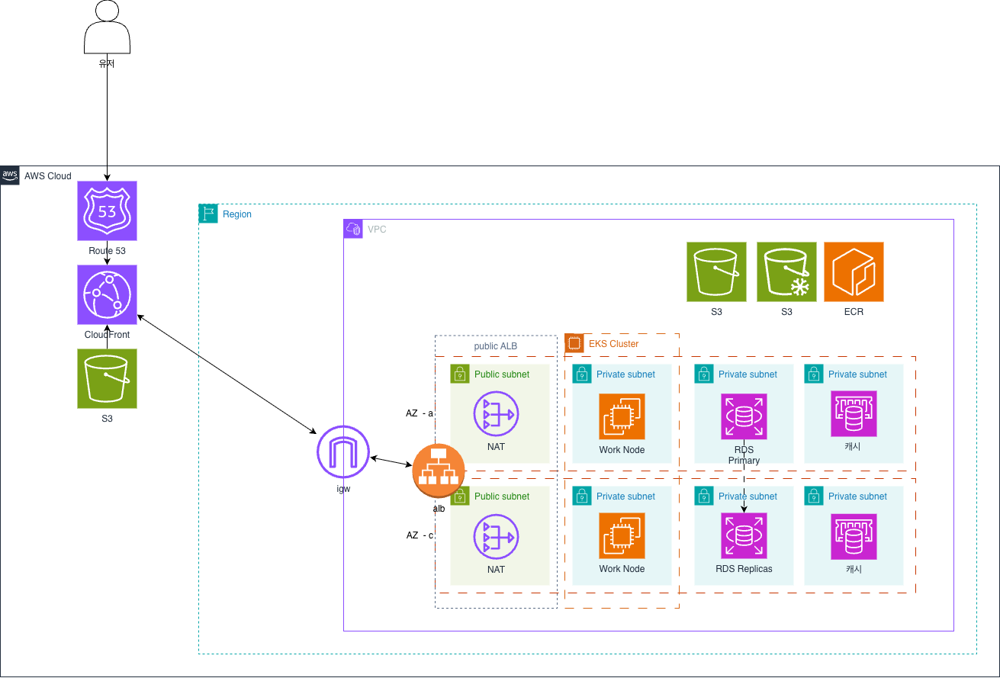

# AWS Architecture

weAlist의 AWS 인프라 아키텍처입니다.

---

## Architecture Diagram

---

## Components

### Compute
- **Amazon EKS** - Kubernetes 클러스터
- **EC2 Node Groups** - 워커 노드
- **Cluster Autoscaler** - 자동 스케일링

### Networking
- **VPC** - 격리된 네트워크
- **Public/Private Subnets** - 서브넷 분리
- **NAT Gateway** - 아웃바운드 트래픽
- **ALB** - Application Load Balancer

### Database
- **Amazon RDS (PostgreSQL)** - 관리형 DB
- **Amazon ElastiCache (Redis)** - 캐시

### Storage
- **Amazon S3** - 오브젝트 스토리지
- **EBS** - 블록 스토리지

### Security
- **IAM** - 권한 관리
- **Security Groups** - 네트워크 ACL
- **Secrets Manager** - 시크릿 관리

---

## Cost Optimization

| Resource | Strategy |
|----------|----------|
| EKS | Spot Instances for non-critical workloads |
| RDS | Reserved Instances for production |
| S3 | Lifecycle policies for old data |
| NAT | Single NAT for dev environments |

---

## Detailed Design

> 상세 설계 문서: [클라우드 설계/아키텍처 (Google Docs)](https://docs.google.com/document/d/1K2L1s3t15OCGDkmCfuXjLbpeDbREeuoT1OP1ldCSGY8)

---

## Related Pages

- [Architecture Overview](Architecture.md)
- [Security (VPC)](Architecture-VPC.md)
- [CI/CD Pipeline](Architecture-CICD.md)
