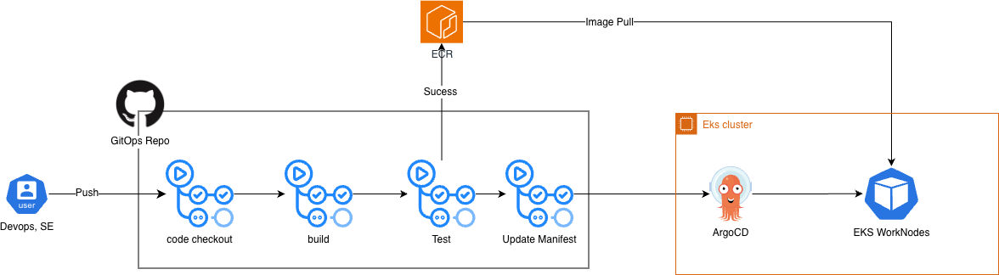

# CI/CD Pipeline

weAlist의 CI/CD 파이프라인 아키텍처입니다.

---

## Pipeline Diagram



---

## Pipeline Stages

### 1. Source (GitHub)
- Branch protection rules
- Pull Request 기반 워크플로우
- Code review 필수

### 2. Build (GitHub Actions)
```yaml
# .github/workflows/ci.yml
- Checkout code
- Run tests
- Build Docker image
- Push to Container Registry
```

### 3. Security Scan
- **Trivy** - Container vulnerability scanning
- **SonarQube** - Code quality analysis
- **Kyverno** - Policy enforcement

### 4. Deploy (ArgoCD)
- GitOps 기반 배포
- Helm chart 업데이트
- Automatic sync

---

## GitOps Workflow

```
Developer
    │
    ├── 1. Push code to feature branch
    │
    ▼
GitHub Actions
    │
    ├── 2. Run tests
    ├── 3. Build & push image
    ├── 4. Update Helm values (image tag)
    │
    ▼
ArgoCD
    │
    ├── 5. Detect changes
    ├── 6. Sync to Kubernetes
    │
    ▼
Kubernetes Cluster
```

---

## Deployment Strategies

| Strategy | Use Case |
|----------|----------|
| **Rolling Update** | 일반적인 배포 |
| **Canary** | 새 기능 점진적 롤아웃 (Argo Rollouts) |
| **Blue-Green** | 무중단 배포 |

---

## Notifications

- **Discord** - 배포 알림
- **Slack** - 에러 알림

---

## Related Pages

- [Architecture Overview](Architecture.md)
- [Getting Started](Getting-Started.md)
