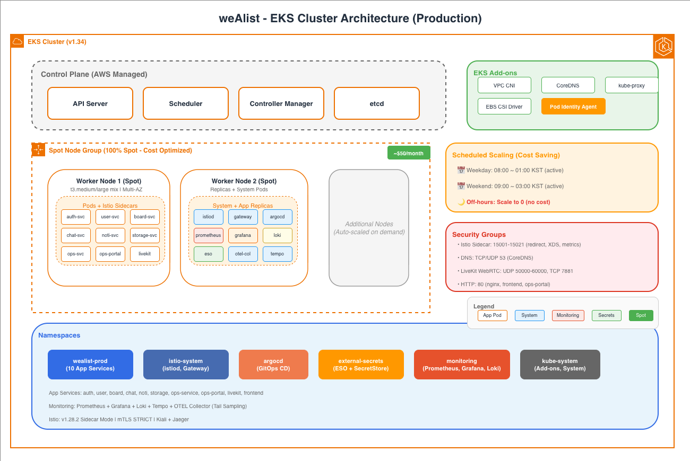

# Kubernetes Architecture

weAlist의 Kubernetes 플랫폼 아키텍처입니다.

---

## Cluster Overview



### Node Configuration

| Type | Instance | vCPU | Memory | 용도 |
|------|----------|------|--------|------|
| **App Nodes** | t3.medium | 2 | 4 GiB | 애플리케이션 워크로드 |
| **DB Nodes** | t3.large | 2 | 8 GiB | StatefulSet (개발 환경) |

> **Production**: Managed Node Groups + Spot Instances 혼합 권장

---

## Namespace Strategy

```
┌────────────────────────────────────────────────────────┐
│                    EKS Cluster                          │
├────────────────────────────────────────────────────────┤
│  ┌──────────────┐  ┌──────────────┐  ┌──────────────┐  │
│  │ wealist-dev  │  │wealist-stage │  │ wealist-prod │  │
│  │              │  │              │  │              │  │
│  │ - Services   │  │ - Services   │  │ - Services   │  │
│  │ - ConfigMaps │  │ - ConfigMaps │  │ - ConfigMaps │  │
│  │ - Secrets    │  │ - Secrets    │  │ - Secrets    │  │
│  └──────────────┘  └──────────────┘  └──────────────┘  │
│                                                         │
│  ┌──────────────┐  ┌──────────────┐  ┌──────────────┐  │
│  │    argocd    │  │  monitoring  │  │ ingress-nginx│  │
│  │              │  │              │  │              │  │
│  │ - Argo CD    │  │ - Prometheus │  │ - Ingress    │  │
│  │ - App of Apps│  │ - Grafana    │  │ - Controller │  │
│  │              │  │ - Loki       │  │              │  │
│  └──────────────┘  └──────────────┘  └──────────────┘  │
└────────────────────────────────────────────────────────┘
```

| Namespace | 용도 | 환경 |
|-----------|------|------|
| `wealist-kind-local` | Kind 로컬 개발 | Local |
| `wealist-dev` | 개발/테스트 | Dev |
| `wealist-staging` | 스테이징 | Staging |
| `wealist-prod` | 운영 | Production |
| `argocd` | GitOps CD | Shared |
| `monitoring` | 모니터링 스택 | Shared |
| `ingress-nginx` | Ingress Controller | Shared |

---

## Workload Architecture


### Service Ports

| Service | Port | Target Port | Type |
|---------|------|-------------|------|
| auth-service | 8080 | 8080 | ClusterIP |
| user-service | 8081 | 8081 | ClusterIP |
| board-service | 8000 | 8000 | ClusterIP |
| chat-service | 8001 | 8001 | ClusterIP |
| noti-service | 8002 | 8002 | ClusterIP |
| storage-service | 8003 | 8003 | ClusterIP |
| video-service | 8004 | 8004 | ClusterIP |
| frontend | 80 | 80 | ClusterIP |

---

## Helm Chart Structure

```
helm/
├── environments/              # 환경별 Values
│   ├── base.yaml              # 공통 설정
│   ├── local-kind.yaml        # Kind 로컬
│   ├── local-ubuntu.yaml      # Ubuntu 개발서버
│   ├── dev.yaml               # AWS Dev
│   ├── staging.yaml           # AWS Staging
│   └── prod.yaml              # AWS Production
│
└── charts/
    ├── wealist-common/        # 공통 템플릿 라이브러리
    ├── wealist-infrastructure/# 인프라 (DB, Redis, Ingress)
    ├── auth-service/
    ├── user-service/
    ├── board-service/
    ├── chat-service/
    ├── noti-service/
    ├── storage-service/
    ├── video-service/
    └── frontend/
```

### Values Merge 순서

```
chart/values.yaml (기본값)
    ↓
base.yaml (공통 설정 덮어씀)
    ↓
{environment}.yaml (환경별 설정이 최종 우선)
```

---

## Resource Management

### Requests & Limits 정책

| Service | CPU Request | CPU Limit | Memory Request | Memory Limit |
|---------|-------------|-----------|----------------|--------------|
| auth-service | 100m | 500m | 256Mi | 512Mi |
| user-service | 50m | 200m | 64Mi | 256Mi |
| board-service | 50m | 200m | 64Mi | 256Mi |
| chat-service | 50m | 200m | 64Mi | 256Mi |
| noti-service | 50m | 200m | 64Mi | 256Mi |
| storage-service | 50m | 200m | 64Mi | 256Mi |
| video-service | 100m | 500m | 128Mi | 512Mi |
| frontend | 50m | 200m | 64Mi | 256Mi |

### Autoscaling (HPA)

```yaml
# Production 권장 설정
apiVersion: autoscaling/v2
kind: HorizontalPodAutoscaler
spec:
  minReplicas: 2
  maxReplicas: 10
  metrics:
  - type: Resource
    resource:
      name: cpu
      target:
        type: Utilization
        averageUtilization: 70
```

---

## Configuration Management

### ConfigMap & Secret 구조

```
┌─────────────────────────────────────────────────────────┐
│                  wealist-infrastructure                  │
├─────────────────────────────────────────────────────────┤
│  ┌─────────────────────┐  ┌─────────────────────┐       │
│  │ ConfigMap           │  │ Secret              │       │
│  │ wealist-shared-config│  │ wealist-shared-secret│      │
│  │                     │  │                     │       │
│  │ - DB_HOST           │  │ - DB_PASSWORD       │       │
│  │ - DB_PORT           │  │ - JWT_SECRET        │       │
│  │ - REDIS_HOST        │  │ - GOOGLE_CLIENT_ID  │       │
│  │ - S3_ENDPOINT       │  │ - GOOGLE_SECRET     │       │
│  └──────────┬──────────┘  └──────────┬──────────┘       │
│             │                        │                   │
│             └──────────┬─────────────┘                   │
│                        │                                 │
│                        ▼                                 │
│  ┌─────────────────────────────────────────────────┐    │
│  │              All Service Deployments             │    │
│  │                                                   │    │
│  │   envFrom:                                        │    │
│  │     - configMapRef: wealist-shared-config        │    │
│  │     - secretRef: wealist-shared-secret           │    │
│  └─────────────────────────────────────────────────┘    │
└─────────────────────────────────────────────────────────┘
```

---

## Security

### RBAC 구조

```
┌─────────────────────────────────────────┐
│            ClusterRole                   │
│  ┌─────────────────────────────────┐    │
│  │ admin (cluster-wide)            │    │
│  │ - Full access to all resources  │    │
│  └─────────────────────────────────┘    │
└─────────────────────────────────────────┘

┌─────────────────────────────────────────┐
│         Namespace: wealist-prod          │
│  ┌─────────────────────────────────┐    │
│  │ Role: developer                 │    │
│  │ - get, list, watch pods         │    │
│  │ - get, list logs                │    │
│  │ - exec into pods (debug)        │    │
│  └─────────────────────────────────┘    │
│  ┌─────────────────────────────────┐    │
│  │ Role: deployer                  │    │
│  │ - create, update deployments    │    │
│  │ - manage configmaps, secrets    │    │
│  └─────────────────────────────────┘    │
└─────────────────────────────────────────┘
```

### Pod Security Standards

| Level | 적용 환경 | 설명 |
|-------|----------|------|
| **Privileged** | - | 사용 안함 |
| **Baseline** | dev, staging | 기본 보안 |
| **Restricted** | prod | 최소 권한 원칙 |

### Network Policies (Phase 2)

```yaml
# 예시: board-service는 user-service만 호출 가능
apiVersion: networking.k8s.io/v1
kind: NetworkPolicy
metadata:
  name: board-service-egress
spec:
  podSelector:
    matchLabels:
      app: board-service
  policyTypes:
  - Egress
  egress:
  - to:
    - podSelector:
        matchLabels:
          app: user-service
    - podSelector:
        matchLabels:
          app: postgres
```

---

## Health Checks

### Probe 설정

| Probe | Path | 용도 |
|-------|------|------|
| **Liveness** | `/health/live` | Pod 재시작 여부 결정 |
| **Readiness** | `/health/ready` | 트래픽 수신 여부 결정 |

```yaml
livenessProbe:
  httpGet:
    path: /health/live
    port: 8000
  initialDelaySeconds: 10
  periodSeconds: 10

readinessProbe:
  httpGet:
    path: /health/ready
    port: 8000
  initialDelaySeconds: 5
  periodSeconds: 5
```

---

## GitOps (Argo CD)

```
┌─────────────────────────────────────────────────────────┐
│                      GitHub Repository                   │
│  ┌─────────────────────────────────────────────────┐    │
│  │ argocd/apps/                                     │    │
│  │ ├── infrastructure.yaml                          │    │
│  │ ├── auth-service.yaml                           │    │
│  │ ├── user-service.yaml                           │    │
│  │ └── ...                                          │    │
│  └──────────────────────┬──────────────────────────┘    │
└─────────────────────────┼───────────────────────────────┘
                          │ sync
                          ▼
┌─────────────────────────────────────────────────────────┐
│                      Argo CD                             │
│  ┌─────────────────────────────────────────────────┐    │
│  │ Application: wealist-infrastructure             │    │
│  │ Application: auth-service                       │    │
│  │ Application: user-service                       │    │
│  │ Application: board-service                      │    │
│  │ ...                                              │    │
│  └─────────────────────────────────────────────────┘    │
└─────────────────────────────────────────────────────────┘
```

---

## Related Pages

- [Architecture Overview](Architecture.md)
- [AWS Architecture](Architecture-AWS.md)
- [Security (VPC)](Architecture-VPC.md)
- [CI/CD Pipeline](Architecture-CICD.md)
- [Monitoring Stack](Architecture-Monitoring.md)
