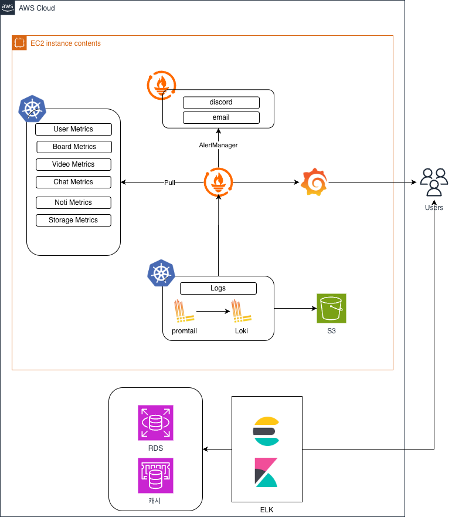

# Monitoring Stack

weAlist의 모니터링 및 로깅 아키텍처입니다.

---

## Monitoring Architecture



---

## Stack Components

| Component | Role | Port |
|-----------|------|------|
| **Prometheus** | 메트릭 수집 | 9090 |
| **Loki** | 로그 수집 | 3100 |
| **Grafana** | 시각화 대시보드 | 3001 |
| **Promtail** | 로그 에이전트 | - |
| **OpenTelemetry** | 분산 트레이싱 (Phase 2) | - |

---

## Metrics Collection

### Application Metrics
```
Go Services:
  - /metrics endpoint (Prometheus format)
  - HTTP request latency
  - Request count by status
  - Active connections

Spring Boot:
  - /actuator/prometheus
  - JVM metrics
  - HTTP metrics
```

### Infrastructure Metrics
- Kubernetes node metrics (node-exporter)
- Pod resource usage (kube-state-metrics)
- Container metrics (cAdvisor)

---

## Log Aggregation

### Log Flow
```
Application
    │
    ├── stdout/stderr
    │
    ▼
Container Runtime
    │
    ▼
Promtail (DaemonSet)
    │
    ▼
Loki
    │
    ▼
Grafana (Query)
```

### Log Labels
- `app` - 서비스 이름
- `namespace` - Kubernetes namespace
- `pod` - Pod 이름
- `level` - log level (info, warn, error)

---

## Alerting

| Alert | Condition | Channel |
|-------|-----------|---------|
| High Error Rate | > 5% 5xx errors | Discord |
| Pod Restart | restart > 3 in 5min | Discord |
| High Memory | > 90% usage | Discord |
| High Latency | p99 > 1s | Discord |

---

## Dashboards

### Service Dashboard
- Request rate
- Error rate
- Latency (p50, p95, p99)
- Active connections

### Infrastructure Dashboard
- Node CPU/Memory
- Pod resource usage
- Network I/O

---

## Related Pages

- [Architecture Overview](Architecture.md)
- [ADR-005: Prometheus + Loki](ADR#adr-005-prometheus--loki-모니터링)
