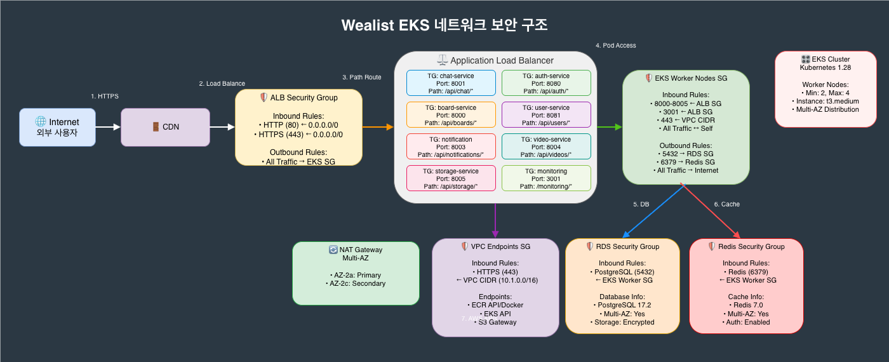

# Security (VPC)

weAlist의 네트워크 및 보안 아키텍처입니다.

---

## VPC Architecture



---

## Network Design

### VPC CIDR
```
VPC: 10.0.0.0/16

Public Subnets:
  - 10.0.1.0/24 (AZ-a)
  - 10.0.2.0/24 (AZ-b)

Private Subnets:
  - 10.0.11.0/24 (AZ-a) - Application
  - 10.0.12.0/24 (AZ-b) - Application
  - 10.0.21.0/24 (AZ-a) - Database
  - 10.0.22.0/24 (AZ-b) - Database
```

### Traffic Flow
```
Internet
    │
    ▼
Internet Gateway
    │
    ▼
ALB (Public Subnet)
    │
    ▼
EKS Pods (Private Subnet - App)
    │
    ▼
RDS/ElastiCache (Private Subnet - DB)
```

---

## Security Groups

| Security Group | Inbound | Outbound |
|----------------|---------|----------|
| **ALB** | 80, 443 from 0.0.0.0/0 | All to VPC |
| **EKS Nodes** | All from ALB SG | All |
| **RDS** | 5432 from EKS SG | None |
| **Redis** | 6379 from EKS SG | None |

---

## Security Measures

### Network Security
- Private subnets for workloads
- NAT Gateway for outbound only
- Network ACLs

### Application Security
- mTLS with Istio (Phase 3)
- JWT token validation
- RBAC in Kubernetes

### Data Security
- Encryption at rest (RDS, S3)
- Encryption in transit (TLS)
- Secrets Manager for credentials

### Compliance
- **Trivy** - Container scanning
- **Kyverno** - Policy enforcement
- Audit logging

---

## Related Pages

- [Architecture Overview](Architecture.md)
- [AWS Architecture](Architecture-AWS.md)
