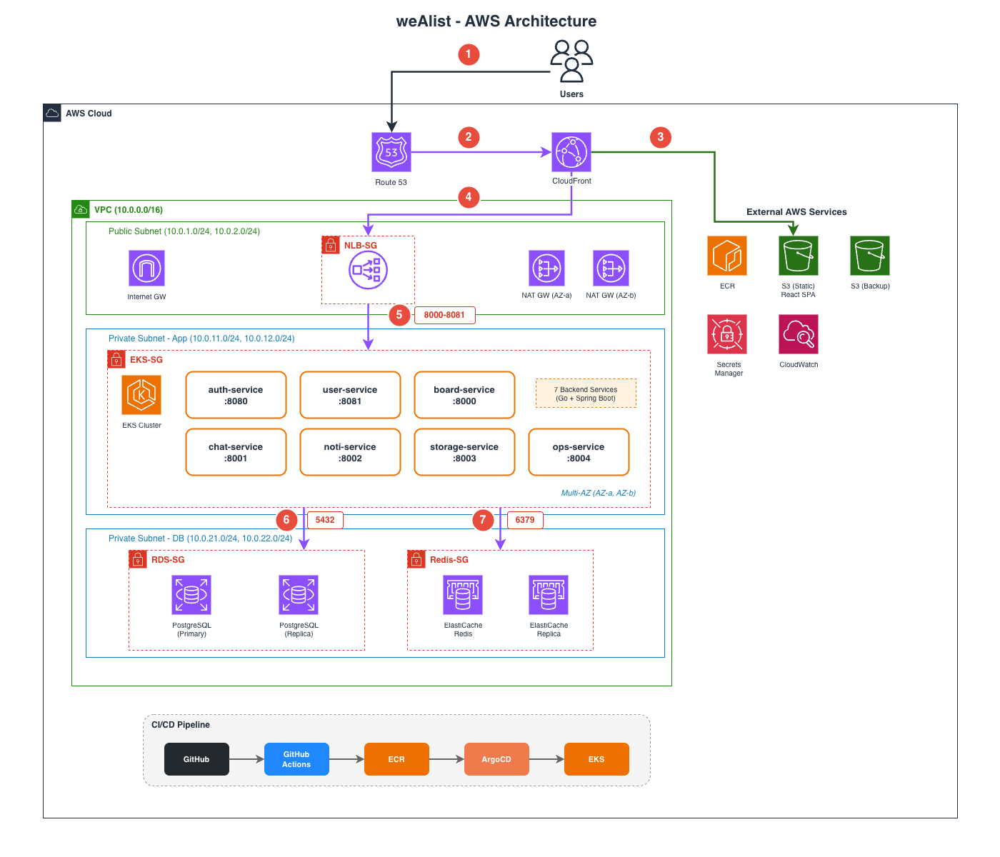
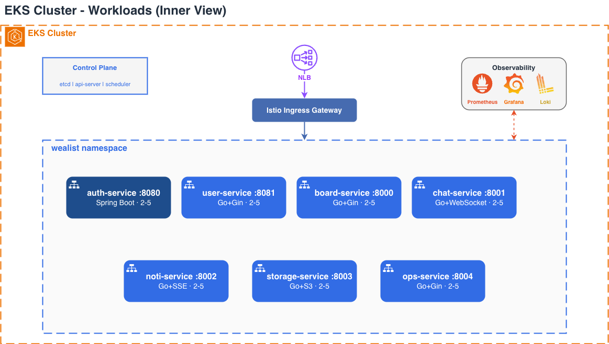
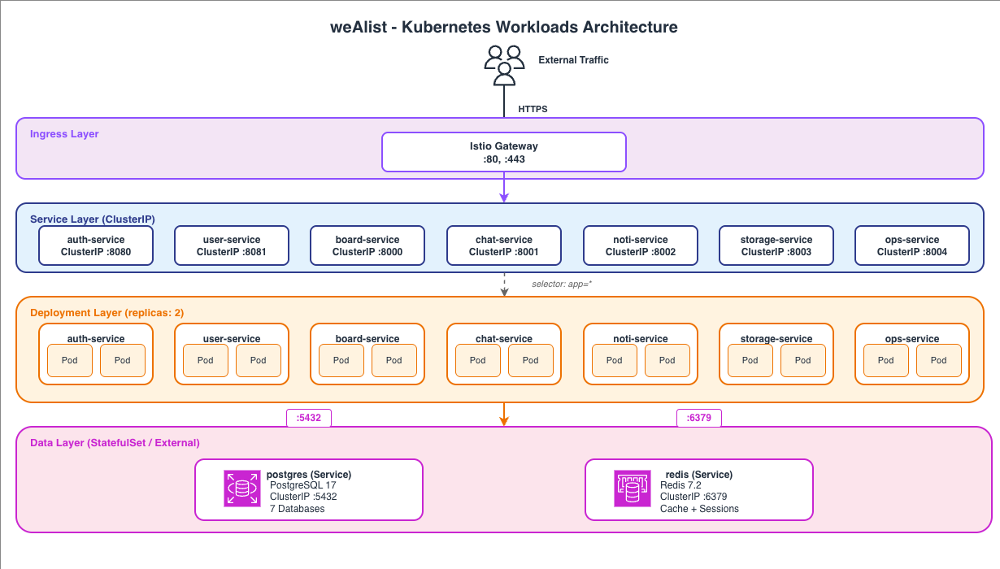

# Architecture Overview

weAlist의 전체 시스템 아키텍처입니다.

---

## AWS Architecture (대표)



> AWS 인프라 상세: [Architecture-AWS](Architecture-AWS.md)

---

## Microservices Architecture



### 서비스 구성

| Service | Tech | Port | Description |
|---------|------|------|-------------|
| **auth-service** | Spring Boot 3 | 8080 | JWT 토큰 관리, OAuth2 인증 (Redis only) |
| **user-service** | Go + Gin | 8081 | 사용자, 워크스페이스 관리 |
| **board-service** | Go + Gin | 8000 | 프로젝트, 보드, 댓글 관리 |
| **chat-service** | Go + Gin | 8001 | 실시간 메시징 (WebSocket) |
| **noti-service** | Go + Gin | 8002 | 푸시 알림 (SSE) |
| **storage-service** | Go + Gin | 8003 | 파일 스토리지 (S3/MinIO) |
| **video-service** | Go + Gin | 8004 | 영상통화 (LiveKit) |
| **frontend** | React + Vite | 3000 | Web UI |

---

## Kubernetes Workloads



> K8s 플랫폼 상세: [Architecture-K8s](Architecture-K8s.md)

---

## Infrastructure

| Component | Technology | Description |
|-----------|------------|-------------|
| **Database** | PostgreSQL 17 | 7개 DB (서비스별 분리) |
| **Cache** | Redis 7.2 | 캐시, 토큰 저장소 |
| **Object Storage** | MinIO | S3 호환 스토리지 |
| **Video** | LiveKit + Coturn | WebRTC SFU, TURN/STUN |
| **API Gateway** | NGINX Ingress | 라우팅, TLS 종료 |
| **Monitoring** | Prometheus + Loki + Grafana | 메트릭/로그/대시보드 |

---

## Service Communication

```
┌─────────────┐
│   Client    │
└──────┬──────┘
       │ HTTPS
       ▼
┌─────────────┐
│   NGINX     │ ─── TLS Termination
│   Ingress   │
└──────┬──────┘
       │
       ├── /api/auth     → auth-service:8080
       ├── /api/users    → user-service:8081
       ├── /api/boards   → board-service:8000
       ├── /api/chats    → chat-service:8001
       ├── /api/notifications → noti-service:8002
       ├── /api/storage  → storage-service:8003
       ├── /api/video    → video-service:8004
       └── /ws/*         → WebSocket proxy
```

### Internal Communication

- **External**: JWT Bearer token in `Authorization` header
- **Internal**: Services call each other via `/internal/*` endpoints

---

## Related Pages

- [AWS Architecture](Architecture-AWS.md)
- [Kubernetes Architecture](Architecture-K8s.md)
- [CI/CD Pipeline](Architecture-CICD.md)
- [Security (VPC)](Architecture-VPC.md)
- [Monitoring Stack](Architecture-Monitoring.md)
