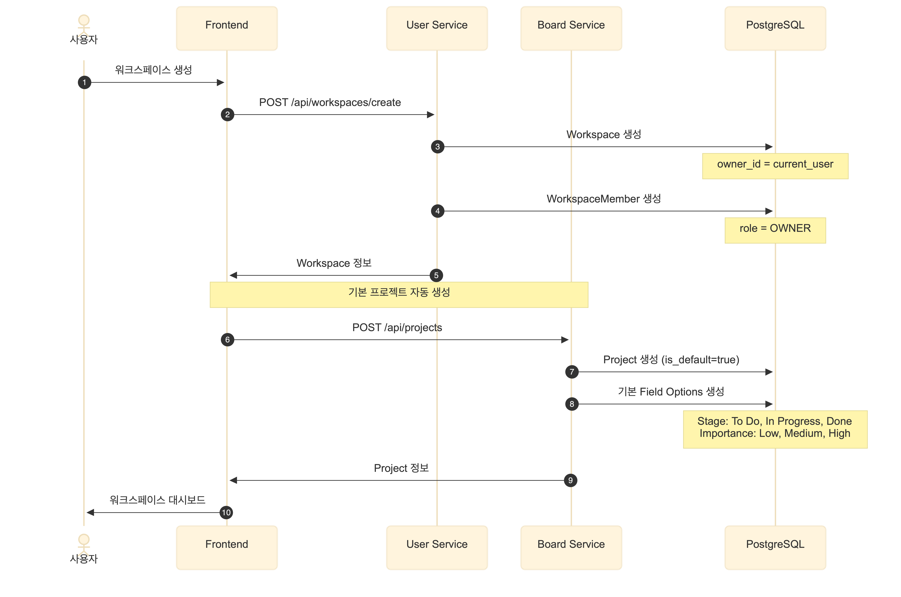

# Business Flow

weAlist의 비즈니스 플로우입니다.

---

## Business Flow Diagram



---

## Core Features

### 1. 워크스페이스 관리
- 워크스페이스 생성/관리
- 멤버 초대/권한 관리
- 워크스페이스 설정

### 2. 프로젝트/보드 관리
- 프로젝트 생성
- 칸반 보드
- 태스크 관리
- 댓글/첨부파일

### 3. 실시간 채팅
- 1:1 채팅
- 그룹 채팅
- 파일 공유
- 메시지 검색

### 4. 알림
- 실시간 알림 (SSE)
- 멘션 알림
- 태스크 알림
- 이메일 알림

### 5. 파일 스토리지
- 파일 업로드/다운로드
- 폴더 관리
- 파일 공유
- 버전 관리

### 6. 영상통화
- 1:1 통화
- 그룹 통화
- 화면 공유
- 녹화

---

## User Journey

### 신규 사용자
```
1. 회원가입 (Google OAuth)
2. 워크스페이스 생성 or 초대 수락
3. 프로젝트 생성
4. 팀원 초대
5. 보드/태스크 작업
6. 채팅/영상통화로 협업
```

### 기존 사용자
```
1. 로그인
2. 알림 확인
3. 할당된 태스크 확인
4. 작업 수행
5. 진행 상황 업데이트
```

---

## Service Interactions

| Feature | Services Involved |
|---------|-------------------|
| **로그인** | auth → user |
| **보드 생성** | board → user (workspace 검증) |
| **댓글 작성** | board → noti (알림 발송) |
| **채팅** | chat → noti (알림) |
| **파일 업로드** | storage → S3 |
| **영상통화** | video → LiveKit |

---

## Related Pages

- [Requirements](Requirements.md)
- [Architecture Overview](Architecture.md)
